:project_name: CompuTech
= Pflichtenheft __{project_name}__
:author: Ahmad Moudallal
:revnumber: 0.1
:revdate: {docdatetime}
:revremark: Work in Progress
:doctype: book
:icons: font
:source-highlighter: highlightjs
:toc: left
:numbered:

== Purpose of this Document

This document represents the Software Requirements Specification (SRS, German: close to a "Pflichtenheft") of the project **{project_name}**.
It aims to provide an overview of the software product to be built and functions as a basis for communication between
the stakeholders of the project, mainly the client and the development team.
It is desired to have this document as the foundation for a contract between the
client and the contractor, and should therefore be validated and checked for consistency.
The SRS describes _what_ the desired system has to fulfill and _partially how_ the contractor intends to implement the solution.

== Task Definition

IT- Dienstleister CompuTech
Die Firma CompuTech beliefert seine Kunden mit PC-Komplettsystemen sowie mit Zubehör und Verbrauchsmaterialien (CDs, Druckerpatronen, Toner, etc.). Die Firma kennt zwei Arten von Kunden, Privat - und Geschäftskunden(B2C & B2B). Ein neues IT-System soll die Beziehung zum Kunden vereinfachen und einen Wettbewerbsvorteil für seine Geschäftskunden bieten.

Geschäftskunden können, wenn sie angemeldet sind, Bestellungen (nur Erweiterungen von Bestehender Hardware oder Upgrade) aufgeben sowie ihren derzeitigen EDV-Bestand einsehen. In der Bestandsanzeige soll der Kunde Geräte auswählen und mit Reparatur- oder Serviceaufträgen versehen können. Keine Aktion geschieht ohne Auftrag! Geschäftskunden werden von einem Mitarbeiter angelegt und mit einem vorläufigen Kennwort versehen welches der Kunde danach ändern kann.

Privatkunden können sich selbst am System anmelden. Eine Überprüfung der Email und Postadresse (ähnlich Web.de) kann helfen die Gültigkeit einer Adresse zu prüfen. Hat sich der Kunde angemeldet so ist es ihm möglich sein, aus einer vorgegebenen Auswahl von Geräten ein Basismodell auszuwählen und dieses nach seinen Wünschen zu konfigurieren. Privatkunden sollen zudem die Möglichkeit bekommen gebrauchte Geräte wieder an CompuTech verkaufen zu können.

Jeder Geschäftskunde hat einen bestimmten Verkaufsleiter als Ansprechpartner. Dieser wird zugeordnet wenn der Verkaufsleiter den Geschäftskunden in der Datenbank anlegt. Der Verkaufsleiter nimmt alle eingehenden Bestellungen und Serviceanfragen entgegen prüft diese und erstellt dann einen Auftrag an das Lager und den Service. Zudem entscheidet der Verkaufsleiter, zu welchem Preis Geräte von Privatkunden zurückgekauft werden.

Das Lager verwaltet den Bestand aller Geräte und Verbrauchsmaterialien. Für alle Posten gibt es Mindestbestände. Werden diese unterschritten, bestellt das Lager automatisch aus einer Auswahl von Händlern zu den günstigsten Konditionen nach. Geht ein Auftrag von einem Verkaufsleiter ein, stellt das Lager die Bestellung zusammen (Kommissionierung) und erstellt dann einen Auftrag für den Versand, welcher sich dann um Auslieferung und Aufstellung der Gerät kümmert. Für den letzten Punkt muss ein Auftrag für den Service erstellt werden.

Das System soll zudem ein „Kassenbuch“ führen, welches die Buchhaltung und den Jahresabschluss vereinfachen soll. Hierzu sollen alle Transaktionen gespeichert und nach bestimmten Filterkriterien gedruckt werden können. Auf diese Daten hat natürlich nur der Geschäftsführer und die Buchhaltung Zugriff.

Dem Kunden ist es besonders wichtig, dass seine Geschäftsprozesse von dem zu entwickelnden IT-System vollständig abgebildet werden.

(Thema ähnlich DELL vgl. http://www.dell.com/ )

== Product Usage

This section is going to give an overview of how the product is intended to be used upon completion and under which circumstances.

The system is going to be used as a web shop by the company CompuTech to sell computers, equipments and computer consumables.
The software is supposed to run on a server and be available through the internet (via a browser) to interested customers 24/7.

The system shall be accessible and visually optimized for the following browsers:

- Mozilla Firefox, version 55.0.3+
- Google Chrome, version 61.0.3163+

The primary users of the software are other businesses, private customers, the company's employees, as well as administrators (Boss),
who do not necessarily have a technical background.

The system shall not need technical maintenance, as the staff of the CompuTech already has its hands full.
Any data shall be stored persistently in a database and be accessible through the application (e.g. no SQL knowledge should be required for a boss).

== Stakeholders
Here is every group or individual (real or juristical) listed, which/who has an impact on the requirements of the system.
In the below table, these stakeholders are listed, a priority is assigned (in case requirements should clash this allows for easier decisions)
and their high-level goals are described.
The assigned priorities range from 1 (lowest priority) to 5 (highest priority).

[options="header", cols="2, ^1, 4, 4"]
|===
|Name
|Priority (1..5)
|Description
|Goals

|CompuTech
|5
|The primary client of this project.
a|
- Sell more computers and equipments
- Automate processes

|Customers (Businesses and Private Customers)
|4
|Primary user of the application, supposed to generate income
a|
- Good user experience
- Easily browsable shop
- Fast order processing

|Administrators (Boss & Employees)
|2
|Users who administer the application (e.g. overview all orders)
a|
- Possibility to overview all the data in the system
- Manage processes

|Developers
|3
|People who are either implementing the application or are responsible for maintenance later on.
a|
- Easily extendable application
- Low maintenance effort
- Good debugging mechanisms

|===

== System Boundaries and Component Structure

=== System Context Diagram

The system context diagram shows the planned system in its environment.
This includes all user types, their ways to access the system, as well as third-party systems, which
access our system or are accessed by it (not the case here).

[[context_diagram]]
image::.\models\analysis\Kontextdiagramm\Kontextdiagramm.jpg[Context Diagram, 80%, 80%, pdfwidth=80%, title= "ContextDiagram", align=center]

=== Top-Level-Architecture

Top-Level view of the system. +
[[TLA]]
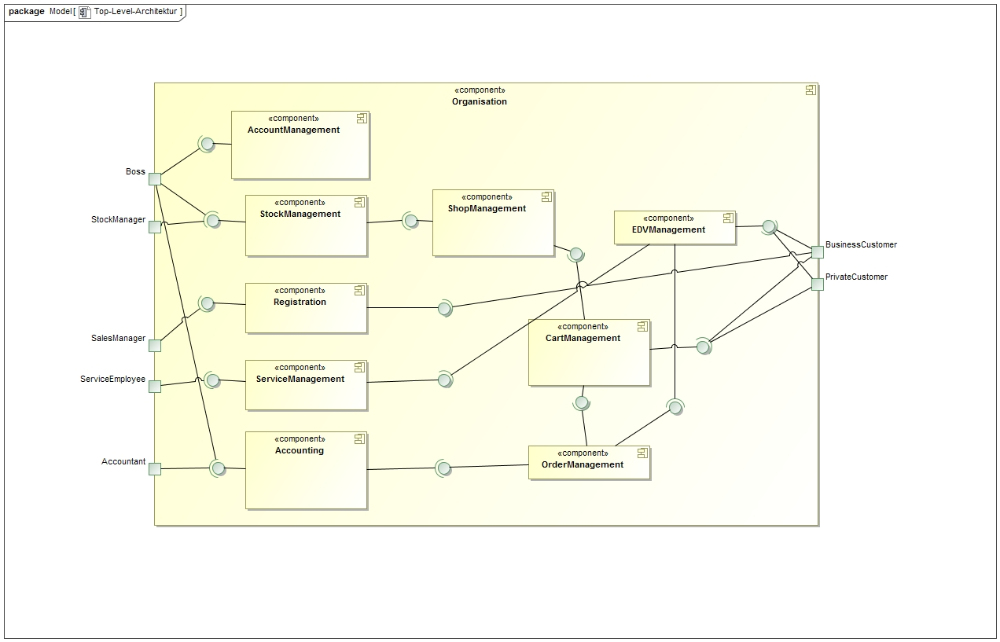

== Use-Cases

This section will give an overview of the use cases the system has to support.
These use cases describe what functionality the system has to provide (mostly) from the client's point of view and which actors are involved.

=== Actors

Actors are users of the system or neighboring systems who/which access it.
The following table summarizes all actors of the system and provides a description of the actor.
Abstract actors (i.e. an actor which groups other actors, written in _italic_) are used to generalize and group.
// See http://asciidoctor.org/docs/user-manual/#tables
[options="header"]
[cols="1,11"]
[[registered_user]]
[[actors]]
|===
|Name |Description
|_User_               | Representative for every person, who interacts who interacts with the system, regardless if authenticated or not.
|Unauthenticated user | Representative for unauthenticated access (i.e. unauthenticated visitors)
|Boss                 | Any registered (and authenticated) user, who has the role "BOSS". Is responsible for administration of the application, adding new employees and viewing the Finances.
|Customer             | Any registered (and authenticated) user, who has the role "CUSTOMER". Only role in the system, which is allowed to buy the content of the cart. The customer has 2 types: private and business customers.
|Employee             | Any registered (and authenticated) user, who has the Role "EMPLOYEE". The system has 4 types of employees: sales manager, stock manager, service employee, accountant
|Private customer  (PC)           | A customer that represents a person or consumer, not a business. The PC can register himself on the system, buy and sell goods from and to the company. The sold goods has to be approved by the sales manager.
|Business customer  (BC)           | A customer that represents a company. The BC gets registered by the sales manager (SM) and has a responsible SM he can contact.
|Sales manager  (SM)           | An employee that can check and approve orders, sold goods, and service orders.
|Stock manager  (StM)           | An employee that can view the stock, add and remove items from it, and order goods from outside providers.
|Service employee  (SE)           | An employee that can view the service orders and do them.
|Accountant  (Acc)           | An employee that can view the finances.
|===

=== Use-Case Diagram
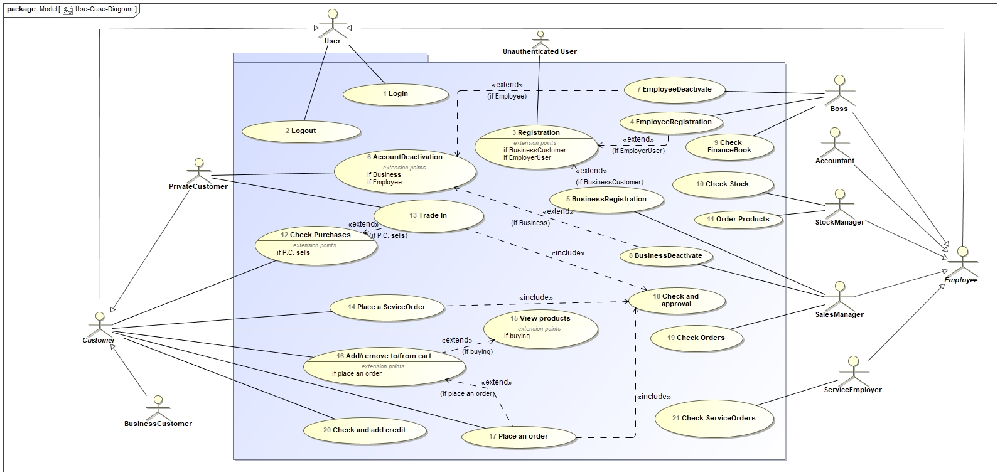

=== Use-Case Descriptions

This section describes the use cases shown in the use case diagram in detail.

[cols="1h, 3"]
[[UC001]]
|===
|ID                         |**<<UC001>>**
|Name                       |Login
|Description                |A user shall be able to login (authenticate) with the system to access further functionality.
|Actors                     |User
|Trigger                    |
_Login_: User wants to access "hidden" functionality by logging in.
|Precondition(s)            |
_Login_: User is not authenticated yet
|Essential Steps            |
_Login_:

  1. User accesses "Log In" in the navigation bar
  2. User enters his credentials
  3. User hits "Log in" button
|Extensions                 |-
|Functional Requirements    |<<F001>>
|===

[cols="1h, 3"]
[[UC002]]
|===
|ID                         |**<<UC002>>**
|Name                       |Logout
|Description                |A user shall be able to log out as a reversible action to UC001
|Actors                     |User
|Trigger                    |
_Logout_: User wants to leave the shop.
|Precondition(s)            |
_Logout_: User is authenticated
|Essential Steps            |
_Logout_:

  1. User hits "Log Out" in the navigation bar
  2. User is unauthenticated and is shown the home screen

|Extensions                 |-
|Functional Requirements    |<<F002>>
|===

[cols="1h, 3"]
[[UC003]]
|===
|ID                         |**<<UC003>>**
|Name                       |Registration
|Description                |An unauthenticated user shall be able to register if he doesn't have an private user account
|Actors                     |unauthenticated user
|Trigger                    | _Registration_: user wants to create a private user account
|Precondition(s)            | The user who wants to create an account is not a company/business or an employee 
|Essential Steps            |
_Registration_:

  1. User hits "Registration" in the navigation bar
  2. User is send to the registration form

|Extensions                 |-
|Functional Requirements    |<<F003>>
|===

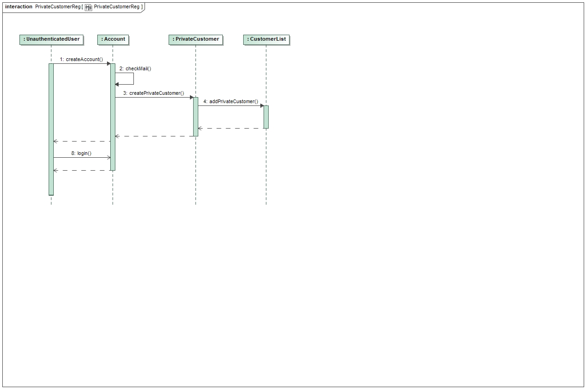

[cols="1h, 3"]
[[UC004]]
|===
|ID                         |**<<UC004>>**
|Name                       |Employee Registration
|Description                |The boss shall be able to register employees
|Actors                     |Boss
|Trigger                    | _Registration_: user wants to create a private user account
|Precondition(s)            |The logged in user is a boss
|Essential Steps            |
_Registration_:

  1. Boss hits "Register Employee" in the navigation bar
  2. Boss is sent to the registration form

|Extensions                 |-
|Functional Requirements    |<<F004>>
|===

[cols="1h, 3"]
[[UC005]]
|===
|ID                         |**<<UC005>>**
|Name                       |Business Registration
|Description                |A sales manager shall be able to register a business as a business account
|Actors                     |Sales manager
|Trigger                    | _Registration_: Sales manager wants to create a business account
|Precondition(s)            |Logged in User is a Sales manager
|Essential Steps            |
_Registration_:

  1. User hits "Register Business" in the navigation bar
  2. User is sent to the registration form

|Extensions                 |-
|Functional Requirements    |<<F005>>
|===

[cols="1h, 3"]
[[UC006]]
|===
|ID                         |**<<UC006>>**
|Name                       |AccountDeactivation
|Description                |A private customer can deactivate his account
|Actors                     |Private customer
|Trigger                    |_AccountDeactivation_: A private customer wants to deactivate his account
|Precondition(s)            |Private customer is logged in
|Essential Steps            |
1. Go to "My Profile" in the navigation
2. Press on "Activate My Account"

|Extensions                 |-
|Functional Requirements    |<<F006>>
|===

[cols="1h, 3"]
[[UC007]]
|===
|ID                         |**<<UC007>>**
|Name                       |EmployeeDeactivate
|Description                |A boss can deactivate employee account
|Actors                     |Boss
|Trigger                    |The boss wants to deactivate an employee's account
|Precondition(s)            |Boss is logged in
|Essential Steps            | 
1. Press on the "Employees" tab in the navigation
2. Near an employee: Press the red "Deactivate" Button
3. Press Ok on the "Are you sure?" message

|Extensions                 |-
|Functional Requirements    |<<F007>>
|===

[cols="1h, 3"]
[[UC008]]
|===
|ID                         |**<<UC008>>**
|Name                       |BusinessDeactivate
|Description                |A sales manager can deactivate a business account
|Actors                     |Sales manager
|Trigger                    |Sales manager wants to deactivate a business account
|Precondition(s)            |Sales manager is logged in
|Essential Steps            |
1. Press on the "My Businesses" tab in the navigation
2. Click on Business you want to Deactivate
3. Press on "Deactivate Business"

|Extensions                 |-
|Functional Requirements    |<<F008>>
|===

[cols="1h, 3"]
[[UC009]]
|===
|ID                         |**<<UC009>>**
|Name                       |Check FinanceBook
|Description                |The boss or/and accountant can check the finance book
|Actors                     |Boss, accountant
|Trigger                    |Boss or accountant are logged in
|Precondition(s)            |Boss or accountant
|Essential Steps            |
1. Press on "FinanceBook" tab in the navigation

|Extensions                 |-
|Functional Requirements    |<<F009>>
|===

[cols="1h, 3"]
[[UC010]]
|===
|ID                         |**<<UC010>>**
|Name                       |Check  Stock
|Description                |A Stock manager can check the stock
|Actors                     |Stock manager
|Trigger                    |Stock manager wants to check and add/remove things from the stock
|Precondition(s)            |Stock manager is logged in
|Essential Steps            |
1. press on the stock tab from the navigation

|Extensions                 |-
|Functional Requirements    |<<F010>>
|===

[cols="1h, 3"]
[[UC011]]
|===
|ID                         |**<<UC011>>**
|Name                       |Order products
|Description                |Stock manager can order products from outside firms
|Actors                     |Stock manager
|Trigger                    |A product reached its minimum amount and stock manager wants to order some
|Precondition(s)            |Stock manager is logged in and/or the product's minimum amount was reached
|Essential Steps            |
1. press on the "stock " tab from the navigation
2. Press on the "Order More" button from the menu

|Extensions                 |-
|Functional Requirements    |<<F011>>
|===

[cols="1h, 3"]
[[UC0012]]
|===
|ID                         |**<<UC0012>>**
|Name                       |Check Purchases
|Description                |A customer can check his purchases and put a service order
|Actors                     |Customer
|Trigger                    |A customer wants to view his purchases and add a service or trade in request
|Precondition(s)            |Customer is logged in
|Essential Steps            |
1. Go to the "My Purchases" tab in the navigation menu

|Extensions                 | 
- If the customer is a private customer then he can put a trade in request
|Functional Requirements    |<<F0012>>
|===

[cols="1h, 3"]
[[UC013]]
|===
|ID                         |**<<UC013>>**
|Name                       |Trade in
|Description                |A private customer can request a trade in to sell some of stuff he bought on this website
|Actors                     |Private customer
|Trigger                    |Private customer wnats to sell something
|Precondition(s)            |Private customer is logged in and has bought something from the website
|Essential Steps            |
1. go to the "My purchases" tab in the navigatio menu
2. Press on the "Request TradeIn" button from near a bought product

|Extensions                 |-
|Functional Requirements    |<<F013>>
|===

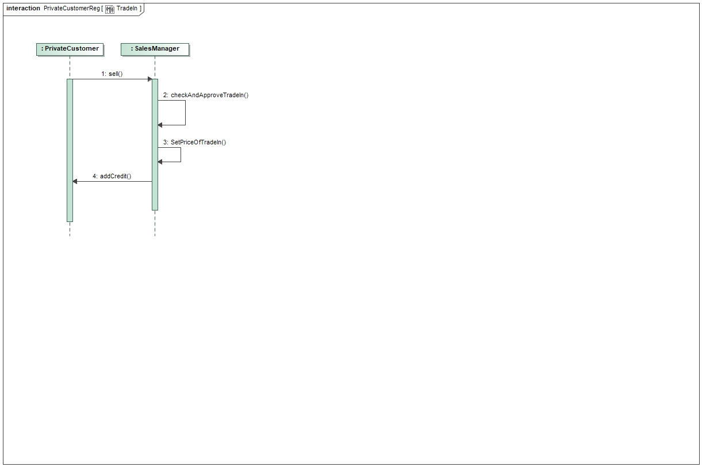

[cols="1h, 3"]
[[UC014]]
|===
|ID                         |**<<UC014>>**
|Name                       |Place a service order
|Description                |A cusomter wants to repair or request something
|Actors                     |Customer
|Trigger                    |Customer wants to repair something
|Precondition(s)            |Customer is logged in
|Essential Steps            |
1. go to the "My purchases" tab in the navigation menu
2. Press on the "Request Service" button from near a bought product

|Extensions                 |
- if the customer is a business customer then his request is sent to his sales manager
|Functional Requirements    |<<F014>>
|===

[cols="1h, 3"]
[[UC015]]
|===
|ID                         |**<<UC015>>**
|Name                       |View Products
|Description                |The customers can see a list of the available products in the shop tab
|Actors                     |Customer
|Trigger                    |Customer wants to buy or check products
|Precondition(s)            |Customer is logged in
|Essential Steps            |
1. Go to the "Shop" tab in the navigation area

|Extensions                 |-
|Functional Requirements    |<<F015>>
|===

[cols="1h, 3"]
[[UC016]]
|===
|ID                         |**<<UC016>>**
|Name                       |Add to/remove from cart
|Description                |Customer wants to add a product he wants to buy to the cart
|Actors                     |Customer
|Trigger                    |Customer found a product he wants to buy
|Precondition(s)            |
_Add_: Customer is logged in and is in the shop area. 

_Remove_: Customer is in the shop area or in the cart menu
|Essential Steps            |
_Add_:
1. Press on "Add to Cart" from near a product in the shop page

_Remove_:
1. Press on "Remove from Cart" from near a product in the shop page
2. If customer is in the cart, press on the red "X" button near a product
|Extensions                 |-
|Functional Requirements    |<<F0016>>
|===

[cols="1h, 3"]
[[UC017]]
|===
|ID                         |**<<UC017>>**
|Name                       |Place an order
|Description                |The customer wants to order products after putting them in a cart
|Actors                     |Customer
|Trigger                    |Customer presses on the "Order" button in the cart page
|Precondition(s)            |Customer is logged in, finished from viewing products
|Essential Steps            |
1. Press on "Cart" from the navigation area.

|Extensions                 |-
|Functional Requirements    |<<F017>>
|===

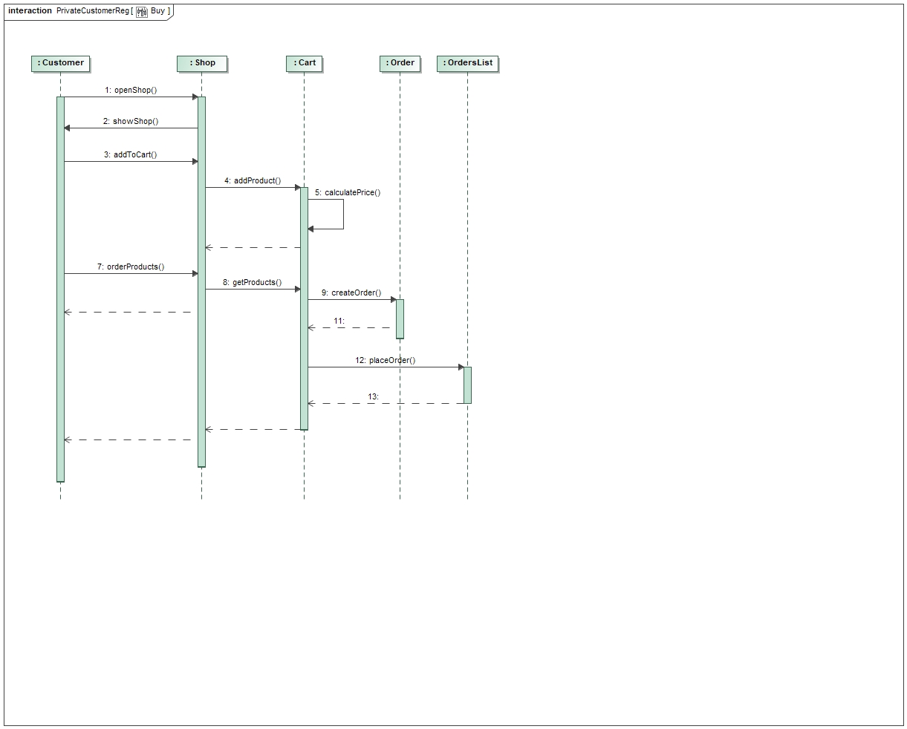

[cols="1h, 3"]
[[UC018]]
|===
|ID                         |**<<UC018>>**
|Name                       |Check and approve
|Description                |The sales manager checks trade in, service and order requests and approves or declines them
|Actors                     |Sales manager
|Trigger                    |Sales manager gets trade in, service or order requests
|Precondition(s)            |Sales manager is logged in, is viewing the requests page 
|Essential Steps            |
1. Press on the "Customer Requests" Tab from the navigation area

|Extensions                 | - The customer gets a notification with the response of the SalesManager
|Functional Requirements    |<<F018>>
|===

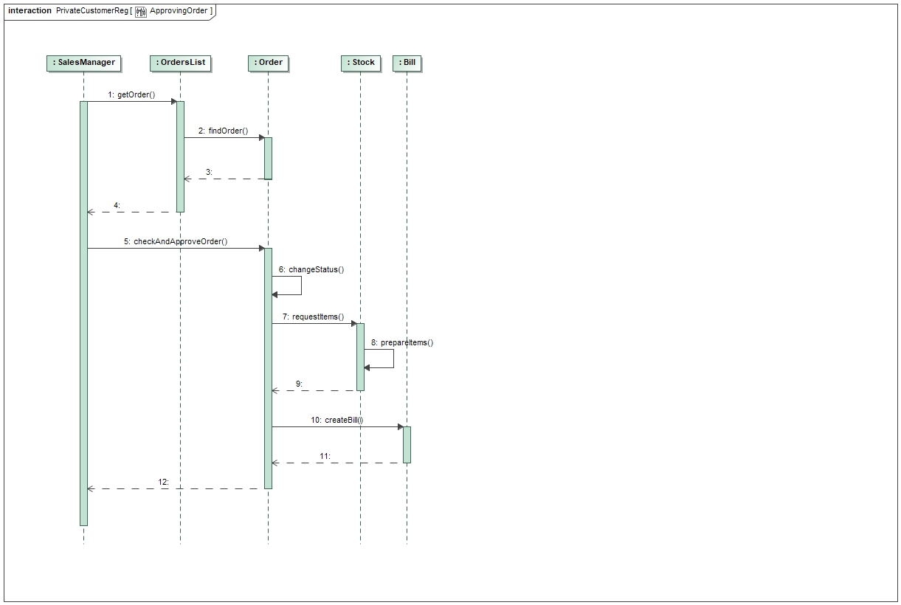

[cols="1h, 3"]
[[UC019]]
|===
|ID                         |**<<UC019>>**
|Name                       |Check orders
|Description                |Sales manager can check all orders
|Actors                     |Sales manager
|Trigger                    |Sales manager wants to check all orders
|Precondition(s)            |Sales manager is logged in
|Essential Steps            |
1. Press on "Orders" from the navigation area.

|Extensions                 |-
|Functional Requirements    |<<F019>>
|===

[cols="1h, 3"]
[[UC020]]
|===
|ID                         |**<<UC020>>**
|Name                       |Check and add credit
|Description                |The customer can add and check his credit
|Actors                     |Customer
|Trigger                    |Customer wants to check or add credit
|Precondition(s)            |Customer is logged in
|Essential Steps            |
1. Press on the "Credit" or "€" button from the navigation area.
2. Press on "Add Credit"
3. Press or put the amount of credit you want to add
4. Press on "Add Credit"

|Extensions                 |-
|Functional Requirements    |<<F020>>
|===

[cols="1h, 3"]
[[UC023]]
|===
|ID                         |**<<UC021>>**
|Name                       |Check service orders
|Description                |The service employee can check his service orders and work on them
|Actors                     |Service employee
|Trigger                    |The service employee wants to check the service orders
|Precondition(s)            |Service employee is logged in
|Essential Steps            |
1. Press on "Orders" tab from the navigation area.

|Extensions                 |-
|Functional Requirements    |<<F023>>
|===

== Functional Requirements

=== Required Features (Muss-Kriterien)
Criteria the system must have.

[options="header", cols="2h, 1, 3, 12"]
|===
|ID
|Version
|Name
|Description

|[[F001]]<<F001>>
|v0.1
|Login
a|

A User needs to be logged in to see more system functionality.
If a user exists in the system, he should be abled to log in with is credentials:

* Username
* Password

|[[F002]]<<F002>>
|v0.1
|Logout
a|

A user should be abled to log out.

|[[F003]]<<F003>>
|v0.1
|Registration
a|

An unauthenticated user shall be able to register if he doesn’t have an private user account, to gain acess to the system.

|[[F004]]<<F004>>
|v0.1
|Employee registration
a|

The boss needs to be abled to create new accounts for new employees.

|[[F005]]<<F005>>
|v0.1
|Business registration
a|

A sales manager needs to be abled to create new business accounts for the corresponding business.

|[[F006]]<<F006>>
|v0.1
|Private account deactivation
a|

A private customer should be abled to deactivate his account.

|[[F007]]<<F007>>
|v0.1
|Employee deactivation
a|

The boss is abled to deactivate an employee account.

|[[F008]]<<F008>>
|v0.1
|Business deactivation
a|

A sales manager should be abled to deactivate a business account.

|[[F009]]<<F009>>
|v0.1
|Check finances
a|

Boss and accountant needs to be abled to view the finances.

|[[F010]]<<F010>>
|v0.1
|Check stock
a|

A stock manager should be abled to check the stock.

|[[F011]]<<F011>>
|v0.1
|Order products
a|

A stock manager should be abled to order stock from firms or automatically when a product reaches a minimum threshold.

|[[F012]]<<F012>>
|v0.1
|Check purchases
a|

A customer should be abled to see his purchases and put services on it.

|[[F013]]<<F013>>
|v0.1
|Trade in
a|

A private customer should be abled to sell back products, bought on this site.

|[[F014]]<<F014>>
|v0.1
|Place service order
a|

A customer should be abled to request a service the system offers.

|[[F015]]<<F015>>
|v0.1
|View products
a|

A customer can view products in the shop.

|[[F016]]<<F016>>
|v0.1
|Use Cart
a|

A customer should be abled to add or remove products from his cart.

|[[F017]]<<F017>>
|v0.1
|Place order
a|

A customer should be abled to order products from his cart.

|[[F018]]<<F018>>
|v0.1
|Check and approve
a|

A sales manager can approve or decline orders.

|[[F019]]<<F019>>
|v0.1
|Check orders
a|

A sales manager can check orders.

|[[F020]]<<F020>>
|v0.1
|Check and add Credit
a|

A customer can check his credit.
A sales manager can charge a credit for the customer.

|[[F021]]<<F021>>
|v0.1
|Check service orders
a|

A service employee can check service orders.

|===

=== Nice-to-have Features(Kann-Kriterien)
Criterias the system can have

- Contact between sales manager and business customer

== Non-Functional Requirements

=== Quality Demands

The following table shows what quality demands have to be fulfilled to which extent. The first column lists the quality demands, while in the following columns an "x" is used to mark the priority. The assigned priority has to be considered in the formulation of the concrete non-functional requirements.

1 = Not important ..
5 = Very important
[options="header", cols="3h, ^1, ^1, ^1, ^1, ^1"]
|===
|Quality Demand           | 1 | 2 | 3 | 4 | 5
|Maintainability          |   |   |   | x |
|Extensibility            |   |   |   |   | x
|Usability                |   |   | x |   |
|Scalability              | x |   |   |   |
|Reliability              |   |   | x |   |
|Security                 |   |   |   | x |
|Performance              |   | x |   |   |
|===

=== Concrete Not-Functional Requirements

Beschreiben Sie Nicht-Funktionale Anforderungen, welche dazu dienen, die zuvor definierten Qualitätsziele zu erreichen.
Achten Sie darauf, dass deren Erfüllung (mindestens theoretisch) messbar sein muss.

== GUI Prototype

The following pictures show what the GUI of the system could look like.

=== Overview: Dialogue Map

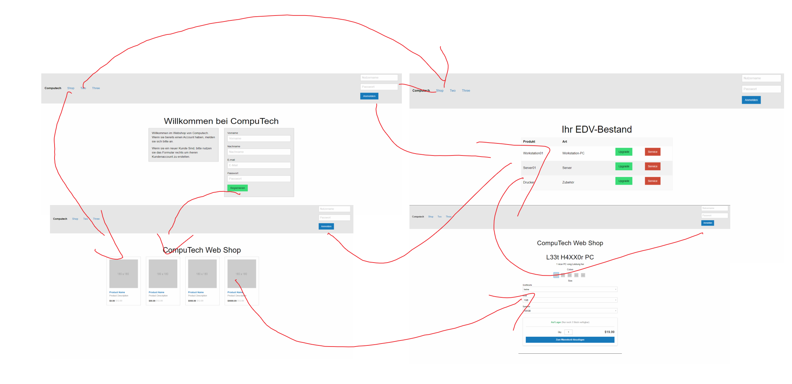

=== Dialogue Description
The first page is the main landing page. Here you can login with your account
or create a private customer account. In the screenshot you can see the top bar
which is used as the main navigation tool. From there you can use links to get
to every page of the system, if your account has the permission for it.

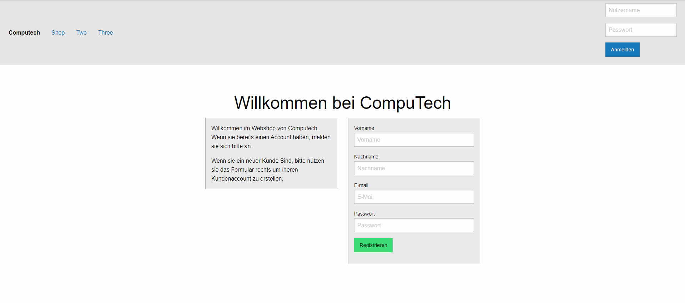

This a screenshot of our shop templatei it features clickable product-cards.
If you click on one of the product-cards you will be taken to a site with
productdetails.

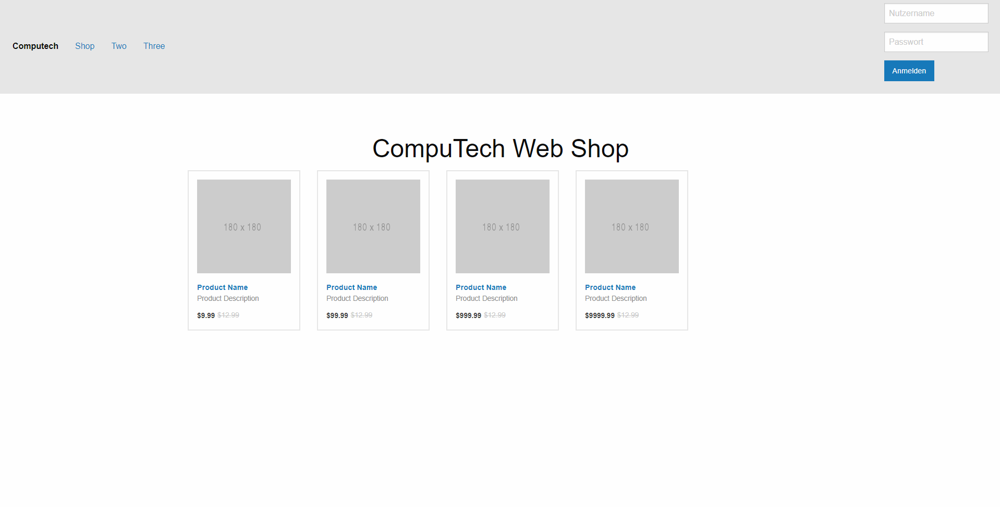

Below is the site with the product details. In the shop you choose a base model
and here you can coustomize things like memory and ram.

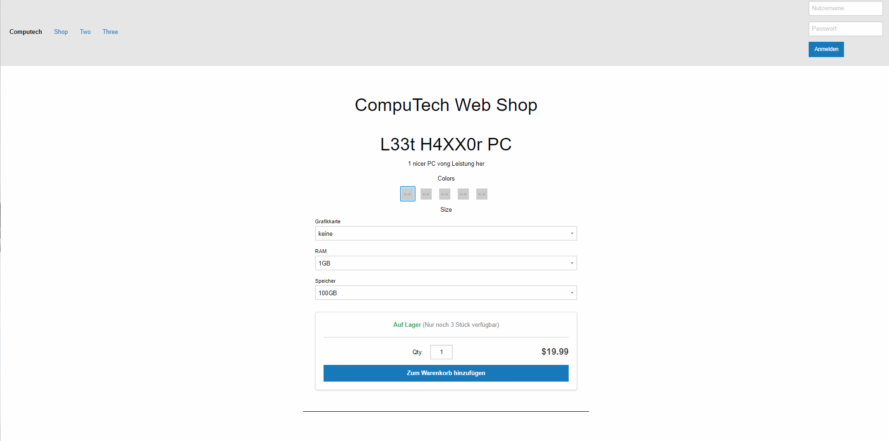

Here is a screenshot of our list template it is used in the EDV-Bestand but also
for the order list the sales manager approves and his buisiness customer list and so on.
In this example though  it only shows the systems brought by one account and gives the
customer the option to upgrade or request a service/repair.

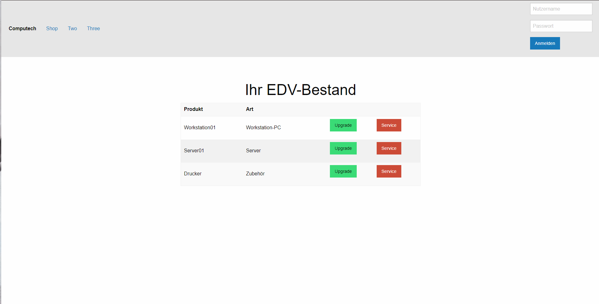

//1. Kurze textuelle Dialogbeschreibung eingefügt: Was soll der jeweilige Dialog? Was kann man damit tun? Überblick?
//2. Maskenentwürfe (Screenshot, Mockup)
//3. Maskenelemente (Ein/Ausgabefelder, Aktionen wie Buttons, Listen, …)
//4. Evtl. Maskendetails, spezielle Widgets

== Data Model

=== Class Diagram

The (analysis) class diagram is supposed to give an overview of the domain in the context of the system, which shall be developed in the scope of this project.

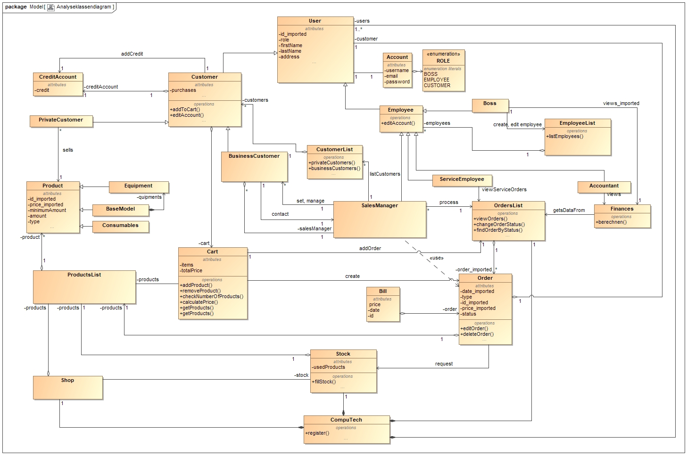

=== Classes and Enumerations
This section represents a combination of glossary and discription of all classes and enumarations. Every class and
Enumaration is represented textual as a glossary. Additionally will potential consistency and formatting rules be listed.

// See http://asciidoctor.org/docs/user-manual/#tables
[options="header"]
|===
|Class/Enumeration  |Description
|Role               |Defines the role of the user, like boss and customer.
|CompuTech          |General class for the site. Stores internal data like the customer list.
|Account            |Class for login and logout to the website, used for customers and employees.
|User               |Holds data concerning name, adress and some internal dates for a person. Assigned to a certain role.
|Boss               |Has access to most functionality on the site. Can view finances and edit or add new employees
|Employee           |Super class for all laborers. 
|ServiceEmployee    |Has access to all orders, that needs to be processed.
|Accountant         |Has acess to finances.
|SalesManager       |Processes all orders from customers.
|Order              |Holds data concerning transactions.
|Bill               |Used to calculate the balance.
|Customer           |Super class for every one shopping on the site. Owns a credit account and a cart.
|Cart               |Collects items for a customer, he intents to purchase.
|CreditAccount      |Deposit for a customer on the site. Can be recharged by a sales manager.
|BusinessCustomer   |Special custumer for business clients. Is asignet to his own sales manager.
|PrivateCustomer    |Special class for private clients. Has no own sales manager. Can trade in hardware bought on the site.
|Product            |Super class for all objects on sale.
|Equipment          |Special product for a hardware piece or periphery. Eg. motherboard, printers.
|BaseModel          |Special product consisting of eqiupment. Can be composed on the site.
|Consumable         |Special product for items like ink cartridges. Will not be taken back.
|Shop               |Displays products from stock.
|Stock              |Computechs warehouse. Can automatically order items, when products of a certain type run low.
|===

== Acceptance Testing
Acceptance tests are used to determine, whether or not the delivered software system fulfills the requirements of the client during the actual usage.
The following table shows which acceptance tests the software system does have to pass at the end of the project in order to satisfy the client and complete the contract (regarding the requirements).

:Pre: Precondition(s)
:Event: Event
:Result: Expected Result

[cols="1h, 4"]
|===
|ID            |<<AT001>>
|Use Case      |<<UC001>>
|{Pre}        a|The system has existing users.
|{Event}      a|An unauthenticated user enters the credentials of an existing user of the system (test, 123) in the given text-field on the "logIn/registration"-screen and presses "Login"
|{Result}     a|
- The user is now authenticated as "test"
- The user is redirected to the startscreen, which displays a personalized welcome message
- The user has now access to every functionality, which are accessible to users with the role "Customer"
|===

[cols="1h, 4"]
|===
|ID            |<<AT002>>
|Use Case      |<<UC002>>
|{Pre}        a|A user is authenticated.
|{Event}      a|An authenticated user hits the logOut button
|{Result}     a|
- The user is now unauthenticated
- The user is redirected to the logIn/registration screen
|===

[cols="1h, 4"]
|===
|ID            |<<AT003>>
|Use Case      |<<UC003>>
|{Pre}        a|An unauthenticated user is using the system.
|{Event}      a|An unauthenticated user is using the registration button on the "logIn/registration"-screen and enters the following information:
- _Name:_ Customer
- _ForeName:_ Test
- _Passwort:_ 123
- _E-Mail:_ TestCustomer@testing.com

Finally, he presses the register button to send the information.
|{Result}     a|
- An new Customer with the provided data is created
- It is possible to authenticate with the credentials of the created customer
|===

[cols="1h, 4"]
|===
|ID            |<<AT004>>
|Use Case      |<<UC004>>
|{Pre}        a|User authenticated as boss.
|{Event}      a|The boss is using the register employee button. Then he enters the employee-data in the register screen with the follwing information:
- _Name:_ Customer
- _ForeName:_ Test
- _Passwort:_ 123
- _E-Mail:_ TestCustomer@testing.com
- _Berechtigung:_ SalesManager

Finally, he presses the register button to send the information.
|{Result}     a|
- A new employee with the provided data is created
- the employee is now listed in the employees-list
- the user of the employe account is now able to logIn with the given data
|===

[cols="1h, 4"]
|===
|ID            |<<AT005>>
|Use Case      |<<UC005>>
|{Pre}        a|User authenticated as sales manager
|{Event}      a|Sales manager using the register business customer button in the "customers"-screen and enters the following information:
- _Name:_ Customer
- _ForeName:_ Test
- _Passwort:_ 123
- _E-Mail:_ TestCustomer@testing.com

Finally, he presses the register button to send the information.
|{Result}     a|
- A new businessAccount with the given information is created.
- The user of the business customer account is now able to log In with the given information
- the business customer is now only listed in the business customers-list of the sales manager, who created the account.
|===

[cols="1h, 4"]
|===
|ID            |<<AT006>>
|Use Case      |<<UC006>>
|{Pre}        a|User is authenticated as customer.
|{Event}      a|The user is using the deactivate account button in the "account data"-screen.
|{Result}     a|
- the account status of the user changes to deactivated
- the user wont be able to log in with his previous account data.
|===

[cols="1h, 4"]
|===
|ID            |<<AT007>>
|Use Case      |<<UC007>>
|{Pre}        a|User authenticated as boss.
|{Event}      a|The user is using the deactivate employee button in the "employees"-screen.
|{Result}     a|
- the employee account status changes to deactivated
- the user of the employee account wont be able to log in with his previous account data
|===

[cols="1h, 4"]
|===
|ID            |<<AT008>>
|Use Case      |<<UC008>>
|{Pre}        a|User is authenticated as sales manager
|{Event}      a|User is using the deactivate businessCustomer button in his own "business customers"-screen.
|{Result}     a|
- the businessCustomer account status changes to deactivated
- the user of the business customer account wont be able to log in with his previous account data
|===

[cols="1h, 4"]
|===
|ID            |<<AT009>>
|Use Case      |<<UC009>>
|{Pre}        a|User is authenticated as boss or accountant
|{Event}      a|The user is pressing the "checkbook"-tab on the web-interface
|{Result}     a|
- the checkbook with all information over the finance of the company is opening + buttons to sort between wins and looses, showing of the year
|===

[cols="1h, 4"]
|===
|ID            |<<AT010>>
|Use Case      |<<UC010>>
|{Pre}        a|User is authenticated as stock manager
|{Event}      a|The user is using the "stock"-tab on the web-interface
|{Result}     a|
- a list of all products+amount is opening + buttons to refill
|===

[cols="1h, 4"]
|===
|ID            |<<AT011>>
|Use Case      |<<UC011>>
|{Pre}        a|User authenticated as stockManager
|{Event}      a|User is using the refill buttton on a product in the "stock"-screen. He enters an amount
|{Result}     a|
- server will search in a list of providers for the cheapest product of the given kind
- server will purchase the amount given by the stockManager from the provider found during the searching-process
|===

[cols="1h, 4"]
|===
|ID            |<<AT012>>
|Use Case      |<<UC012>>
|{Pre}        a|User is authenticated as customer
|{Event}      a|User is using the "My purchases"-tab
|{Result}     a|
- shows a list of all his purchases of non-consuming products he ever bought from the company + service-order/sell(private customer only)/repair/upgrade button for each product
|===

[cols="1h, 4"]
|===
|ID            |<<AT013>>
|Use Case      |<<UC013>>
|{Pre}        a|User is authenticated as private customer
|{Event}      a|User is using the sell-button in his "My purchases"-screen
|{Result}     a|
- the system will create an order with the sell-assignement
|===

[cols="1h, 4"]
|===
|ID            |<<AT014>>
|Use Case      |<<UC014>>
|{Pre}        a|User is authenticated as customer
|{Event}      a|User is using the service-button in his "My purchases"-screen
|{Result}     a|
- the system will create an order with the service-assignement
|===

[cols="1h, 4"]
|===
|ID            |<<AT015>>
|Use Case      |<<UC015>>
|{Pre}        a|User is authenticated as customer
|{Event}      a|User is using the "Shop"-tab
|{Result}     a|
- server will load the list of all products, which are purchaseable by customers
- each product contains price, stockamount, a text-field and a buy-button
|===

[cols="1h, 4"]
|===
|ID            |<<AT016>>
|Use Case      |<<UC016>>
|{Pre}        a|User authenticated as customer
|{Event}      a|User is pressing the buy-button in the shop with the amount the user writes in the given textfield in a product in the "shop"-screen
|{Result}     a|
- adding the product with the given amount in the cart
|===

[cols="1h, 4"]
|===
|ID            |<<AT017>>
|Use Case      |<<UC016>>
|{Pre}        a|User authenticated as customer
|{Event}      a|User is pressing the remove-button in his "cart"-screen on a product
|{Result}     a|
- if the amount of the product is bigger then 1, it will substract 1 from the amount of the product in the cart
- if the amount of the product is equal to 1, it will remove the product from the cart
|===

[cols="1h, 4"]
|===
|ID            |<<AT018>>
|Use Case      |<<UC017>>
|{Pre}        a|User is authenticated as customer
|{Event}      a|User is pressing the purchase-button in the his "cart"-screen
|{Result}     a|
- If the cart is empty, it will show an error messang containing: "Cart is empty".
- If the cart is not empty, an purchase order with all the products, the cart is containing, will be created and added to the oerder list
- the cart of the user is set empty
|===

[cols="1h, 4"]
|===
|ID            |<<AT019>>
|Use Case      |<<UC018>>
|{Pre}        a|User authenticated as sales manager
|{Event}      a|User is using the "Orders"-list. User is using the approve-button on an order
|{Result}     a|
- the server will fulfill the order
- the order is removed from the orders-list
|===

[cols="1h, 4"]
|===
|ID            |<<AT020>>
|Use Case      |<<UC018>>
|{Pre}        a|User authenticated as sales manager
|{Event}      a|User is using the "Orders"-list. User is using the decline-button on an order
|{Result}     a|
- the user who created the order will resieve a message
- the order is removed from the orders-list
|===

[cols="1h, 4"]
|===
|ID            |<<AT021>>
|Use Case      |<<UC019>>
|{Pre}        a|User authenticated as sales manager
|{Event}      a|User is pressing the "Orders"-tab
|{Result}     a|
- loading of the orders-list
|===

//== Glossary
//Sämtliche Begriffe, die innerhalb des Projektes verwendet werden und deren gemeinsames Verständnis aller beteiligten //Stakeholder essentiell ist, sollten hier aufgeführt werden.
//Insbesondere Begriffe der zu implementierenden Domäne wurden bereits beschrieben, jedoch gibt es meist mehr Begriffe, die //einer Beschreibung bedürfen. +
//Beispiel: Was bedeutet "Kunde"? Ein Nutzer des Systems? Der Kunde des Projektes (Auftraggeber)?

//== Open Points
//Offene Punkte werden entweder direkt in der Spezifikation notiert. Wenn das Pflichtenheft zum finalen Review vorgelegt wird, //sollte es keine offenen Punkte mehr geben.
